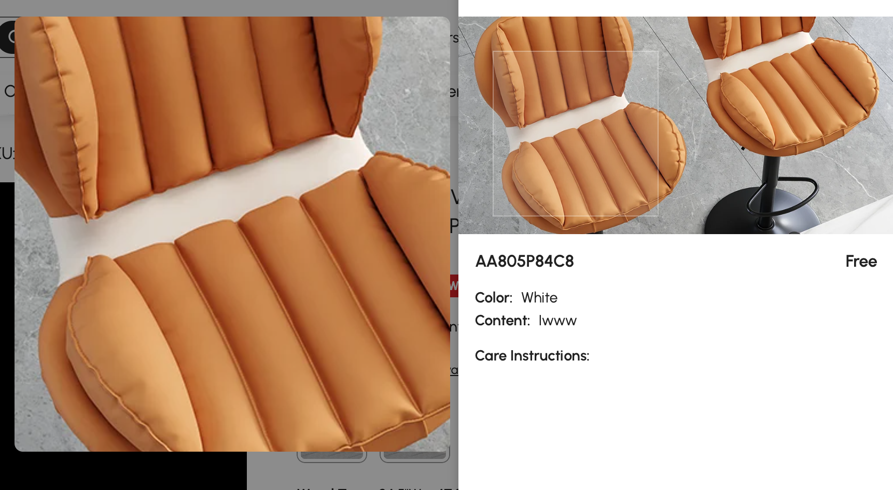
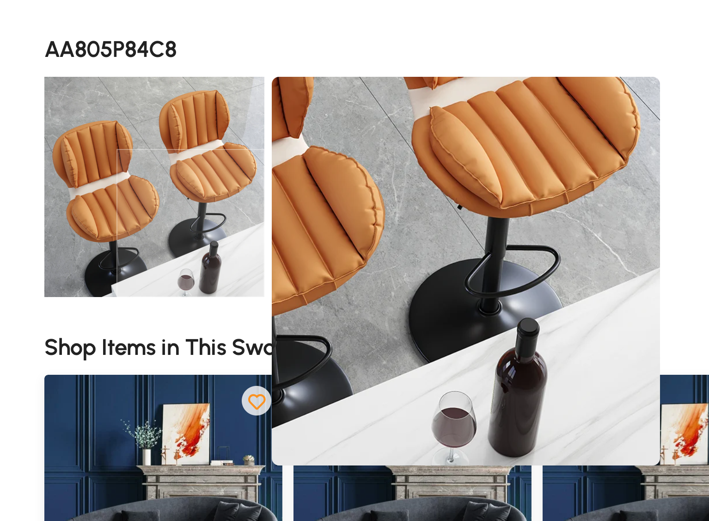

# ZoomImage 移动鼠标放大图片组件


```
        imageUrl: {
            type: String,
            default: ''//图片路径
        },
        position: {
            type: String,
            default: 'right' //放大图片的位置：left right
        },
        zoomGap: {
            type: Number,
            default: 8 //放大图和原图的距离，间隔默认8px
        }
```

```
            <ZoomImage v-if="isZoomImage" :image-url="swatchDetail.sku_cover_img" position="left" :zoom-gap="zoomGap"></ZoomImage>
```




```
                        <ZoomImage :image-url="swatchDetailRes.sku_cover_img"></ZoomImage>

```

